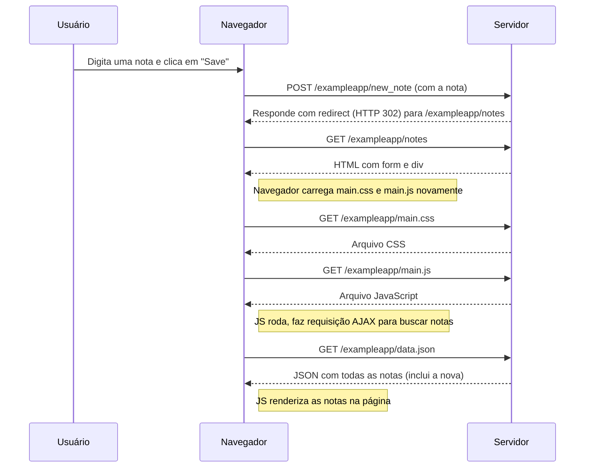

```mermaid
sequenceDiagram
    participant Usuário
    participant Navegador
    participant Servidor

    Usuário->>Navegador: Digita uma nota e clica em "Save"
    Navegador->>Servidor: POST /exampleapp/new_note (com a nota)
    Servidor-->>Navegador: Responde com redirect (HTTP 302) para /exampleapp/notes
    Navegador->>Servidor: GET /exampleapp/notes
    Servidor-->>Navegador: HTML com form e div#notes

    Note right of Navegador: Navegador carrega main.css e main.js novamente

    Navegador->>Servidor: GET /exampleapp/main.css
    Servidor-->>Navegador: Arquivo CSS

    Navegador->>Servidor: GET /exampleapp/main.js
    Servidor-->>Navegador: Arquivo JavaScript

    Note right of Navegador: JS roda, faz requisição AJAX para buscar notas

    Navegador->>Servidor: GET /exampleapp/data.json
    Servidor-->>Navegador: JSON com todas as notas (inclui a nova)

    Note right of Navegador: JS renderiza as notas na página
```
