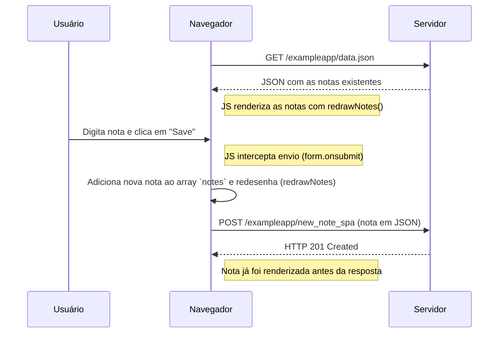

```mermaid
sequenceDiagram
    participant Usuário
    participant Navegador
    participant Servidor

    Navegador->>Servidor: GET /exampleapp/data.json
    Servidor-->>Navegador: JSON com as notas existentes
    Note right of Navegador: JS renderiza as notas com redrawNotes()

    Usuário->>Navegador: Digita nota e clica em "Save"
    Note right of Navegador: JS intercepta envio (form.onsubmit)

    Navegador->>Navegador: Adiciona nova nota ao array `notes` e redesenha (redrawNotes)

    Navegador->>Servidor: POST /exampleapp/new_note_spa (nota em JSON)
    Servidor-->>Navegador: HTTP 201 Created

    Note right of Navegador: Nota já foi renderizada antes da resposta
```
