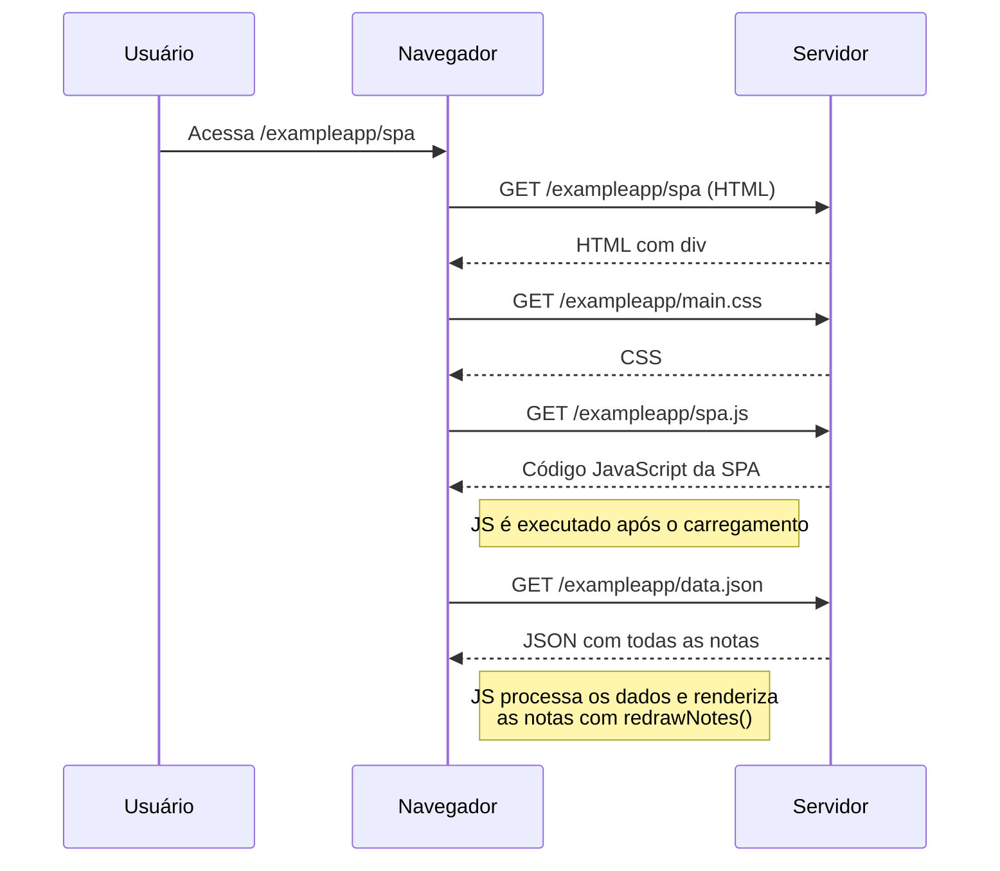

```mermaid
sequenceDiagram
    participant Usuário
    participant Navegador
    participant Servidor

    Usuário->>Navegador: Acessa /exampleapp/spa
    Navegador->>Servidor: GET /exampleapp/spa (HTML)
    Servidor-->>Navegador: HTML com div#notes e formulário

    Navegador->>Servidor: GET /exampleapp/main.css
    Servidor-->>Navegador: CSS

    Navegador->>Servidor: GET /exampleapp/spa.js
    Servidor-->>Navegador: Código JavaScript da SPA

    Note right of Navegador: JS é executado após o carregamento

    Navegador->>Servidor: GET /exampleapp/data.json
    Servidor-->>Navegador: JSON com todas as notas

    Note right of Navegador: JS processa os dados e renderiza<br>as notas com redrawNotes()
```
