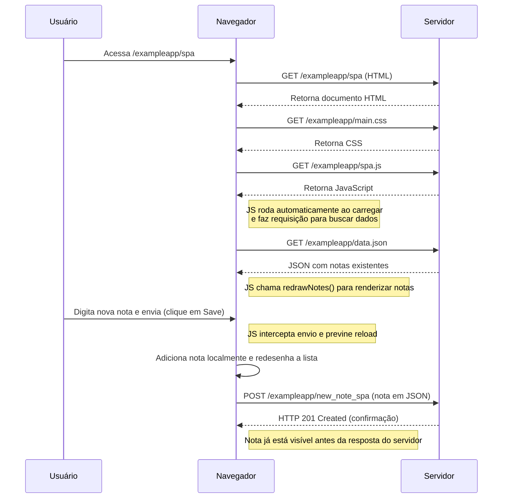

```mermaid
sequenceDiagram
    participant Usuário
    participant Navegador
    participant Servidor

    Usuário->>Navegador: Acessa /exampleapp/spa
    Navegador->>Servidor: GET /exampleapp/spa (HTML)
    Servidor-->>Navegador: Retorna documento HTML

    Navegador->>Servidor: GET /exampleapp/main.css
    Servidor-->>Navegador: Retorna CSS

    Navegador->>Servidor: GET /exampleapp/spa.js
    Servidor-->>Navegador: Retorna JavaScript

    Note right of Navegador: JS roda automaticamente ao carregar<br>e faz requisição para buscar dados

    Navegador->>Servidor: GET /exampleapp/data.json
    Servidor-->>Navegador: JSON com notas existentes

    Note right of Navegador: JS chama redrawNotes() para renderizar notas

    Usuário->>Navegador: Digita nova nota e envia (clique em Save)
    Note right of Navegador: JS intercepta envio e previne reload

    Navegador->>Navegador: Adiciona nota localmente e redesenha a lista
    Navegador->>Servidor: POST /exampleapp/new_note_spa (nota em JSON)
    Servidor-->>Navegador: HTTP 201 Created (confirmação)

    Note right of Navegador: Nota já está visível antes da resposta do servidor

```
